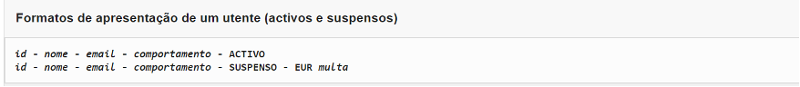
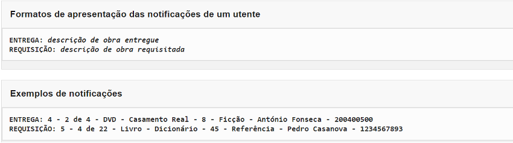
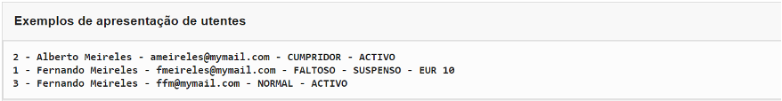
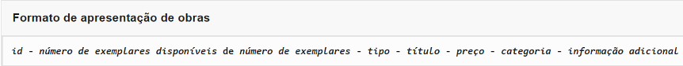
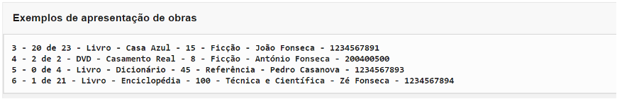
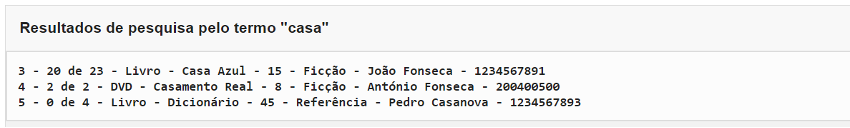
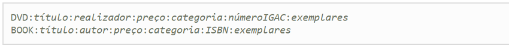
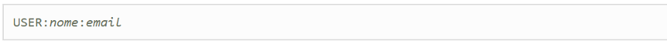
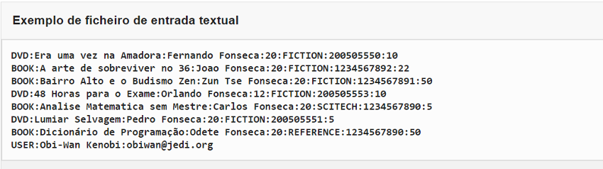

# Projeto - Programação Orientada a Objetos

<!-- TOC -->
* [Projeto - Programação Orientada a Objetos](#projeto---programação-orientada-a-objetos)
* [1. Enquadramento](#1-enquadramento)
* [2. Conceitos e Relações do modelo](#2-conceitos-e-relações-do-modelo)
  * [2.1 Obras e Categorias](#21-obras-e-categorias)
  * [2.2 Utentes](#22-utentes)
  * [2.3 Requisições](#23-requisições)
  * [2.4 Pesquisas](#24-pesquisas)
  * [2.5 Gestão do Tempo](#25-gestão-do-tempo)
  * [2.6 Notificações](#26-notificações)
* [3. Requisitos de Desenho](#3-requisitos-de-desenho)
* [4. Funcionalidades da aplicação](#4-funcionalidades-da-aplicação)
  * [4.1. Menu Principal](#41-menu-principal)
    * [4.1.1. Abrir um ficheiro de dados](#411-abrir-um-ficheiro-de-dados)
    * [4.1.2. Guardar o estado da aplicação](#412-guardar-o-estado-da-aplicação)
    * [4.1.3. Mostrar Data Atual:](#413-mostrar-data-atual)
    * [4.1.4. Avançar Data Atual:](#414-avançar-data-atual)
    * [4.1.5. Gestão e consulta de dados da aplicação](#415-gestão-e-consulta-de-dados-da-aplicação)
  * [4.2. Menu de Gestão de Utentes](#42-menu-de-gestão-de-utentes)
    * [4.2.1. Registar utente:](#421-registar-utente)
    * [4.2.2. Mostrar utente:](#422-mostrar-utente)
    * [4.2.3. Mostrar notificações do utente:](#423-mostrar-notificações-do-utente)
    * [4.2.4. Mostrar utentes:](#424-mostrar-utentes)
    * [4.2.5. Pagar Multa:](#425-pagar-multa)
  * [4.3. Menu de Gestão de Obras](#43-menu-de-gestão-de-obras)
    * [4.3.1 - Mostrar obra:](#431---mostrar-obra)
    * [4.3.2. Listar obras:](#432-listar-obras)
    * [4.3.4. Efetuar pesquisa:](#434-efetuar-pesquisa)
  * [4.4. Menu de Gestão de Requisições:](#44-menu-de-gestão-de-requisições)
    * [4.4.1 Requisitar obra:](#441-requisitar-obra)
    * [4.4.2. Devolver obra:](#442-devolver-obra)
* [5. Leitura de Dados a Partir de Ficheiros Textuais](#5-leitura-de-dados-a-partir-de-ficheiros-textuais)
* [6. Componentes da Avaliação](#6-componentes-da-avaliação)
* [7. Testes automáticos](#7-testes-automáticos)
* [8. Ligação ao GIT e configuração do IDE](#8-ligação-ao-git-e-configuração-do-ide)
* [9. Considerações finais](#9-considerações-finais)
<!-- TOC -->

Entrega: a difundir

# 1. Enquadramento

Entende-se por mediateca um arquivo, devidamente organizado, de documentos informativos e culturais em diversos suportes (disco, CD, cassete, filme, papel, diapositivo, etc.), reunidos num só local e normalmente disponíveis ao público em geral, para consulta ou empréstimo.

Para gerir e organizar uma mediateca, as organizações dispõem de Sistemas de Informação de modo a poderem inserir, listar registos, bem como gerir os empréstimos dos artigos que a compõem.

O objetivo do projeto é desenvolver um sistema para gerir o acervo de uma mediateca. O sistema deverá permitir, entre outras operações:

1. Fazer pesquisas de obras;
2. Registar dados de utentes;
3. Registar dados de obras;
4. Registar requisições de obras para consulta domiciliária.

# 2. Conceitos e Relações do modelo

Existem vários conceitos importantes neste contexto: **obras** e as suas **categorias**, **utentes**, **requisições** e **tempo**.

Os conceitos listados não são os únicos possíveis no modelo e as suas relações (assim como relações com outros conceitos não mencionados) podem depender das escolhas do projeto.

## 2.1 Obras e Categorias

O sistema mantém um registo de obras da mediateca. Cada obra é identificada por um número de obra. O identificador é atribuído automaticamente e incrementalmente (a partir de 0 ou do último valor atribuído, caso o estado do sistema tenha sido recuperado). As obras registam ainda o número de exemplares existentes no acervo da mediateca (várias cópias da mesma obra). Todas as obras têm um título (cadeia de caracteres) e um preço (número inteiro, por simplicidade).

> A primeira obra a inserir possuirá um número de obra igual a `1`

Cada obra tem uma categoria, de acordo com o assunto nela tratado. Inicialmente, consideram-se as seguintes categorias: 
- (i) obras de referência: onde se incluem dicionários, gramáticas, enciclopédias e documentários; 
- (ii) obras de ficção; e 
- (iii) obras técnicas e científicas. 
 
Deve ser possível criar novas categorias, com um impacto mínimo sobre o sistema desenvolvido. 

> Ou seja o desenho do sistema deve garantir a possibilidade de evolução do mesmo

As obras a considerar inicialmente são:
- Livros e 
- DVDs. 
 
As propriedades específicas de cada um (além das gerais) são as seguintes:

- Livros – O sistema deverá manter, para cada livro, a seguinte informação: autor (apenas um, por simplicidade), e ISBN (cadeia de caracteres).
- DVDs – Para cada DVD, o sistema deverá manter: realizador (apenas um, por simplicidade), e o número de registo na IGAC (Inspeção-Geral das Atividades Culturais) (cadeia de caracteres).

Deve ser possível criar novos tipos de obras. O impacto da introdução dos novos tipos na implementação desenvolvida deve ser mínimo.

Existem inicialmente três categorias de obra: obras de referência, obras de ficção e obras técnicas e científicas. Deve ser possível adicionar novas categorias com impacto mínimo na aplicação já desenvolvida.

## 2.2 Utentes

O sistema mantém um registo de utentes da mediateca. Cada utente é identificado por um número de utente. O identificador é atribuído automaticamente e incrementalmente (a partir de 0 ou do último valor atribuído, caso o estado do sistema tenha sido recuperado).

> O primeiro utente a inserir possuirá um número de obra igual a `1`

O sistema mantém ainda, para cada utente, o seu nome, endereço de correio eletrónico. Estes campos não podem ser vazios. É ainda mantida informação sobre a situação do utente perante a mediateca:
- (i) activo, i.e., o utente pode fazer requisições; 
- (ii) suspenso, i.e., o utente não pode fazer novas requisições.

Um utente é suspenso se não devolver uma obra requisitada dentro do prazo estipulado; permanece suspenso até devolver a obra e pagar a multa referente ao atraso na entrega.

A mediateca distingue entre utentes que cumprem as regras de funcionamento e utentes que violam sistematicamente os compromissos. Existe ainda uma classificação intermédia para novos utentes ou para utentes com comportamento misto, nomeadamente:

- Um utente que nas últimas 3 requisições não tenha cumprido os prazos de devolução, é classificado como **faltoso**. Um utente faltoso que proceda a 3 devoluções consecutivas dentro do prazo é considerado **normal**. 
- Um cliente que tenha cumprido rigorosamente os prazos de entrega nas últimas 5 requisições é classificado como **cumpridor**.
- Em todos os outros casos, o utente não tem classificação especial e é considerado **normal**. 

> Como se verá adiante, a classificação influencia a capacidade de requisição do utente.

O comportamento (no que diz respeito a entrega, dentro ou fora do prazo, de obras requisitadas antes da suspensão) de um utente suspenso só influencia a sua classificação após o pagamento da multa.

> Por exemplo, se, antes de pagar a multa, o utente entregar 3 obras dentro do prazo e regularizar a sua situação, então passará a ser um utente que pode efetuar requisições com a classificação de normal. 
 
O desenho da aplicação deve considerar ser, no futuro, possível discriminar os utentes quanto à sua conduta, considerando outros critérios ou novas classificações, com um impacto mínimo na implementação desenvolvida.

## 2.3 Requisições

O sistema garante o cumprimento de regras para a requisição de obras. As regras dependem das características da obra que se pretende requisitar e da conduta passada do utente. Utentes cumpridores estão sujeitos a regras permissivas enquanto que a utentes faltosos são aplicadas regras restritivas. Os restantes utentes seguem um conjunto de regras de base. As regras gerais a respeitar pelos utentes são:

1. Não pode requisitar duas vezes a mesma obra (i.e., em duas requisições diferentes e simultaneamente abertas).
2. Não pode requisitar obras um utente que esteja suspenso;
3. Não pode requisitar obras cujos exemplares tenham sido já todos requisitados;
4. Não pode ter mais que n obras requisitadas em cada momento (valor base: 3; utentes cumpridores: 5; utentes faltosos: 1);
5. Não pode requisitar obras de referência;
6. Não pode requisitar obras com um preço superior a €25,00 (não aplicável a utentes cumpridores);

No caso de violação da regra 3, o utente pode pedir para ser notificado assim que algum exemplar seja devolvido. A notificação consiste na indicação de que a obra já se encontra disponível.

Ao requisitar uma obra, o utente deve ser informado da data limite para a devolução. O tempo de requisição permitido para cada obra depende do número total de exemplares que constem do acervo da mediateca e da conduta do utente. Os prazos, em dias, são os seguintes:

- Obras com apenas um exemplar – valor de base: 3; utentes cumpridores: 8; utentes faltosos: 2;
- Obras com 5 exemplares ou menos – valor de base 8; utentes cumpridores: 15; utentes faltosos: 2;
- Obras com mais de 5 exemplares – valor de base 15; utentes cumpridores: 30; utentes faltosos: 2.

Se o utente não entregar as obras requisitadas no prazo devido, fica imediatamente suspenso, não podendo requisitar mais obras até regularizar a situação. Por cada dia de atraso, o utente fica sujeito ao pagamento de uma multa de €5,00 (cinco euros). A situação só se considera regularizada após a devolução das obras em atraso e o pagamento da multa. Para efeitos de pagamento de multas, frações de dia contam como um dia (a unidade de tempo do sistema é o dia).

> Deve ser possível alterar ou acrescentar regras para a requisição de obras, bem como fazer alterações aos tempos de requisição permitidos. As alterações devem ter impacto mínimo na implementação desenvolvida.

## 2.4 Pesquisas

Para permitir que o sistema ajude os utentes a determinar a existência de uma obra, deverá ser possível efetuar pesquisas. As pesquisas consideram os campos relevantes das várias obras. Deve ser possível introduzir novos métodos de pesquisa de uma obra com um impacto mínimo na implementação desenvolvida.


## 2.5 Gestão do Tempo

A unidade de tempo do sistema é o dia. A data do sistema começa no dia 0 (zero) e faz parte do estado persistente. Sempre que a data é alterada, deve ser verificada a situação dos utentes. Para o efeito o dia deve ser representado por um inteiro (não é necessário a utilização de classes que representam data/tempo).

## 2.6 Notificações

Deve existir um mecanismo de notificações que permita avisar eventuais interessados quando as obras ficam em determinadas situações:

Quando uma obra é emprestada, quer-se enviar uma notificação a todos as entidades que demonstraram interesse nessa operação.

Quando uma obra é devolvida, quer-se enviar uma notificação a todos as entidades que demonstraram interesse nessa operação.

A apresentação das notificações enviadas para um dado utilizador deve ser feita quando se visualiza o utilizador (ver abaixo). Quando se faz a visualização, são anexadas à descrição do utilizador (no final) todas as notificações recebidas. Após esta visualização, considera-se que o utilizador fica sem notificações. As notificações devem ser apresentadas pela mesma ordem em que foram enviadas pelo sistema.

Note-se que existem diferença relativamente aos vários pedidos de notificações. No caso de notificações relativamente a obras emprestadas, quer-se receber uma notificação sempre que a obra indicada é requisitada. No caso dos pedidos de notificação relativos à devolução de obras, apenas se quer receber uma notificação quando a obra indicada for devolvida.

# 3. Requisitos de Desenho

Apesar de não se pedir a implementação, devem ser possíveis extensões ou alterações de funcionalidade com impacto mínimo no código já produzido para a aplicação. O objetivo é aumentar a flexibilidade da aplicação relativamente ao suporte de novas funções. Assim, a aplicação deve ser desenhada para que no futuro, com o mínimo impacto, ser possível:

- Adicionar novos tipos (e.g., CDs ou VHS) e novas categorias de obras;
- Definir novas entidades que desejem ser notificadas da requisição ou devolução de obras;
- Introduzir alterações nas regras para requisição de obras ou nos prazos de requisição permitidos;
- Definir novas classificações para os utentes, para além de faltoso, cumpridor ou normal.

Embora na especificação atual não seja possível a remoção de obras ou de utilizadores, a inclusão destas funcionalidades deve ser prevista, por forma a minimizar o impacto da sua futura inclusão.

# 4. Funcionalidades da aplicação

A aplicação permite manter informação sobre as entidades do modelo, permitindo, em particular, gerir utentes, obras e empréstimos. Possui ainda a capacidade de preservar o seu estado (não é possível manter várias versões do estado da aplicação em simultâneo).

A base de dados com os conceitos pré-definidos é carregada no início da aplicação. Não é possível remover utentes ou obras durante a execução da aplicação.

Note-se que não é necessário implementar de raiz a aplicação: já existem classes que representam e definem a interface geral da funcionalidade do core da aplicação, tal como é visível pelos comandos da aplicação.

A interface geral do core já está parcialmente implementada na classe `atec.poo.mediateca.core.LibraryManager` e outras fornecidas (cujos nomes devem ser mantidos), devendo ser adaptadas onde necessário. É ainda necessário criar e implementar as restantes classes que suportam a operação da aplicação.

**Serialização**: É possível guardar e recuperar o estado atual da aplicação, preservando toda a informação relacionada com a mediateca e que foi descrita acima. Para o efeito deve ser utilizada a interface `java.io.Serializable`

Descreve-se nesta secção a funcionalidade máxima da interface com o utilizador. Em geral, os comandos pedem toda a informação antes de proceder à sua validação (exceto onde indicado). Todos os menus têm automaticamente a opção Sair (fecha o menu).

As operações de pedido e apresentação de informação ao utilizador devem realizar-se através do objeto ui (Instância de Dialogo) presente em cada objeto `Comando`. As mensagens são produzidas pelos métodos e atributos das bibliotecas de suporte (`package atec.poo.mediateca.app` e package `atec.poo.ui`). As mensagens não podem ser usadas no núcleo da aplicação (core). Além disso, não podem ser definidas novas. Potenciais omissões devem ser esclarecidas antes de qualquer implementação.

Note-se que o programa principal os comandos e menus, a seguir descritos, já estão parcialmente implementados no package package `atec.poo.mediateca.app`, nomeadamente:

- `atec.poo.mediateca.app.main`: Menu Principal da Aplicação 
- `atec.poo.mediateca.app.requests`: Menu de Gestão de Requisições
- `atec.poo.mediateca.app.users`: Menu de Gestão de Utentes
- `atec.poo.mediateca.app.works`: Menu de Gestão de Obras
  
Estas classes são de uso obrigatório e estão disponíveis no servidor Git em uso neste módulo

## 4.1. Menu Principal

As ações deste menu permitem gerir a salvaguarda do estado da aplicação e abrir submenus. A lista completa é a seguinte: 
- Abrir, 
- Guardar, 
- Mostrar data actual, 
- Avançar data actual, 
- Menu de Gestão de Utentes, 
- Menu de Gestão de Obras e 
- Menu de Gestão de Requisições. 

Inicialmente, a aplicação apenas tem informação sobre as entidades que foram carregados no arranque (através do atributo `import` explicado mais à frente neste documento).

> As etiquetas das opções deste menu estão definidas nas interfaces `atec.poo.mediateca.app.main.Label` . 
> Todos os métodos correspondentes às mensagens de diálogo com o utilizador, para este menu, estão definidos na interface `atec.poo.mediateca.app.main.Message`.

Todos os comandos  já estão implementados nas classes do package, sendo elas : `DoOpen`, `DoSave`, `DoDisplayDate`, `DoAdvanceDate`, `DoOpenUsersMenu`, `DoOpenWorksMenu`, `DoOpenRequestsMenu`.

O conteúdo da aplicação (toda a informação detida pela mediateca atualmente em memória) pode ser guardado para posterior recuperação (via serialização Java: `java.io.Serializable`). Na leitura e escrita do estado da aplicação, devem ser tratadas as exceções associadas. 

A funcionalidades do Menu Principal (Comandos) são as seguinte:

### 4.1.1. Abrir um ficheiro de dados

Carrega os dados de uma sessão anterior a partir de um ficheiro previamente guardado (ficando este ficheiro associado à aplicação, para futuras operações de salvaguarda). Pede-se o nome do ficheiro a abrir (`atec.poo.mediateca.app.main.Message.openFile()`). Caso ocorra um problema na abertura ou processamento do ficheiro, deve ser lançada a exceção `atec.poo.mediateca.app.exceptions.FileOpenFailedException`. A execução bem sucedida desta opção, em qualquer altura e independentemente da informação existente, substitui toda a informação da aplicação.
  
### 4.1.2. Guardar o estado da aplicação

Guarda o estado atual da aplicação no ficheiro associado. Se não existir associação, pede-se o nome do ficheiro a utilizar, ficando a ele associado. Esta interacão realiza-se através do método `atec.poo.mediateca.app.main.Message.newSaveAs()`. Não é executada nenhuma ação se não existirem alterações desde a última salvaguarda.

> Note-se que a opção Abrir não permite a leitura de ficheiros de texto (estes apenas são utilizados na inicialização da aplicação através do `import`).

A opção Sair nunca guarda o estado da aplicação, mesmo que existam alterações.

> O utilizar se quiser guardar o estado da aplicação terá que selecionar guardar

### 4.1.3. Mostrar Data Atual:

A data actual do sistema é apresentada através da mensagem `atec.poo.mediateca.app.main.Message.currentDate()`.

### 4.1.4. Avançar Data Atual:

O número de dias a avançar é pedido através de `atec.poo.mediateca.app.main.Message.requestDaysToAdvance()`. O valor indicado deve ser positivo. Caso contrário, a operação não tem efeito.

> Não há mensagem de erro. Simplesmente a aplicação não executa

Além da data, o sistema deve atualizar, caso seja necessário, outros aspetos que dela dependam, designadamente, a situação dos utentes relativa a prazos.

### 4.1.5. Gestão e consulta de dados da aplicação

- Menu de Gestão de Utentes -- Abre o menu de gestão de utentes e operações associadas.
- Menu de Gestão de Obras -- Abre o menu de gestão de obras e operações associadas.
- Menu de Gestão de Requisições -- Abre o menu de gestão de requisições e operações associadas.

## 4.2. Menu de Gestão de Utentes

Este menu permite efetuar operações sobre a base de dados de utentes da biblioteca. A lista completa é a seguinte: 
- Registar utente,
- Mostrar utente, 
- Mostrar utentes, 
- Mostrar notificações do utente, 
- Pagar multa.

As etiquetas das opções deste menu estão definidas na interface `package atec.poo.mediateca.app.users.Label`. Todos os métodos correspondentes às mensagens de diálogo para este menu estão definidos na interface `atec.poo.mediateca.app.users.Message`.

Sempre que for pedido o identificador de um utente (através do método estático `atec.poo.mediateca.app.users.Message.requestUserId()`) e o utente não existir, é lançada a exceção `atec.poo.mediateca.app.exceptions.NoSuchUserException`.

Estes comandos já estão implementados nas classes do package `atec.poo.mediateca.app.users` (disponível no servidor Git), respetivamente: 
- `DoRegisterUser`: Registar Utente
- `DoShowUser`: Mostrar Utente
- `DoShowUserNotifications`: Listar Notificações do Utente
- `DoShowUsers`: Listar Utentes
- `DoPayFine`: Pagar Multa.

### 4.2.1. Registar utente:

Pede o nome (`Message.requestUserName()`) e o endereço de correio eletrónico (`Message.requestUserEMail()`). 

O registo bem sucedido é assinalado através da mensagem `Message.userRegistrationSuccessful()`; caso contrário, é lançada a exceção `atec.poo.mediateca.app.exceptions.UserRegistrationFailedException`.

Note-se que a atribuição do identificador do utente é automática e que utentes diferentes são registados em cada operação de registo.

### 4.2.2. Mostrar utente:

É pedido o identificador do utente, sendo apresentadas as informações sobre esse utente, de acordo com o seguinte formato (e variações descritas abaixo). A multa a apresentar, para utentes suspensos, é um valor inteiro.



**Exemplos:**

```console
1 - Obi-Wan Kenobi - obiwan@jedi.org - NORMAL - ACTIVO
```

```console
1 - Obi-Wan Kenobi - obiwan@jedi.org - NORMAL - SUSPENSO - EUR 8
```


### 4.2.3. Mostrar notificações do utente:

É pedido o identificador do utente, sendo apresentadas as notificações para esse utente, de acordo com o seguinte formato (correspondente aos casos descritos acima):


Note-se que a descrição é idêntica à que é realizada para mostrar cada obra. No entanto, a solução deve ser suficientemente flexível para permitir outros formatos de apresentação das notificações (sem impacto no código do domínio da aplicação).



### 4.2.4. Mostrar utentes:

Apresenta informações sobre todos os utentes, ordenando-os lexicograficamente pelo nome. Caso existam utentes com o mesmo nome, devem ser ordenados por ordem crescente dos seus identificadores. O formato de cada utente é conforme apresentado em 4.2.2.:



### 4.2.5. Pagar Multa:

Pede o identificador do utente cuja multa deve ser paga. Se o utente estiver suspenso, a multa é saldada e o utente passa a poder requisitar obras, de acordo com as regras gerais. Se o utente não estiver suspenso, i.e., não tem multas por saldar, deve lançar-se uma exceção `atec.poo.mediateca.app.exceptions.UserIsActiveException`.

## 4.3. Menu de Gestão de Obras

Este menu apresenta as operações disponíveis sobre obras. A lista completa é a seguinte: 
- Mostrar obra, 
- Mostrar (Listar) obras e 
- Efetuar pesquisa.

As etiquetas das opções deste menu estão definidas na interface `atec.poo.mediateca.app.works.Label`. Todos os métodos correspondentes às mensagens de diálogo para este menu estão definidos na interface `atec.poo.mediateca.app.works.Message`.

Sempre que é pedido o identificador da obra (`requestWorkId()`), é lançada a exceção `atec.poo.mediateca.app.exceptions.NoSuchWorkException`, se a obra indicada não existir.

Estes comandos já estão implementados nas classes do package `atec.poo.mediateca.app.works` (disponível no servidor Git), respetivamente: 
- `DoShowWork`: Mostrar Obra,
- `DoShowWorks`: Listar Obras e 
- `DoPerformSearch`: Procurar Obras.

### 4.3.1 - Mostrar obra:

É pedido o identificador da obra (requestWorkId()). Se a obra existir, é apresentada de acordo com os seguintes formatos (para livros e DVDs).

O formato genérico de apresentação de obras é como se segue:



Para livros, a informação adicional corresponde ao autor e ao ISBN; para DVDs, a informação adicional corresponde ao realizador e ao número de registo no IGAC. Veja exemplos abaixo



> Atenção que em Mostrar Obra só é mostrada a informação de uma Obra

### 4.3.2. Listar obras:

Apresenta informações sobre todas as obras, ordenando-as pelos seus identificadores. O formato de apresentação é como descrito em Mostrar obra.


### 4.3.4. Efetuar pesquisa:

Esta opção realiza uma procura por termo (cadeia de caracteres), pedido através de `Message.requestSearchTerm()`. Como resultado, deve ser apresentada uma lista das obras encontradas pela pesquisa, ordenadas por ordem crescente do seu identificador, utilizando o formato descrito para Mostrar obra.

O termo de pesquisa deve ser comparado (sem distinção entre letras maiúsculas e minúsculas) com os campos relevantes de cada obr, nomeadamente: 
- para **DVDs**: o realizador e o título; 
- para **livros**: o autor e o título. 

> **Importante**: Só devem ser apresentadas obras que contenham o termo de pesquisa num dos campos relevantes.

Assim, considerando as quatro obras no exemplo acima, uma pesquisa pelo termo *casa* retornaria as obras com os identificadores 3, 4 e 5.



Caso não sejam encontradas obras, não deve ser produzido qualquer resultado.

## 4.4. Menu de Gestão de Requisições:

Este menu apresenta as operações relacionadas com requisições de obras. A lista completa é a seguinte: 
- Requisitar obra, 
- Devolver obra.

As etiquetas das opções deste menu estão definidas na interface `atec.poo.mediateca.app.requests.Label`. Todos os métodos correspondentes às mensagens de diálogo para este menu estão definidos na interface `atec.poo.mediateca.app.requests.Message`.

Sempre que é pedido o identificador do utente (`Message.requestUserId()`), é lançada a exceção `atec.poo.mediateca.app.exceptions.NoSuchUserException`, se o utente indicado não existir. Sempre que é pedido o identificador da obra (`requestWorkId()`), é lançada a exceção `atec.poo.mediateca.app.exceptions.NoSuchWorkException`, se a obra indicada não existir.

Estes comandos já estão parcialmente implementados nas classes da package `atec.poo.mediateca.app.requests` (disponível no servidor Git), respetivamente: 
- `DoRequestWork`: Requisitar Obra,
- `DoReturnWork`: entregar Obra.

### 4.4.1 Requisitar obra:

No processo de requisição de uma obra, o sistema pede, primeiro, a identificação do utente e, de seguida, o identificador da obra a requisitar. Se o utente não puder requisitar a obra (considerando-se as regras definidas acima), deve ser lançada a excepção `atec.poo.mediateca.app.exceptions.RuleFailedException` (exceto regra 3: ver a seguir).

Se a requisição não for possível por falta de exemplares (violação da regra 3), deve-se perguntar ao utente, utilizando a mensagem `requestReturnNotificationPreference()`, se deseja ser notificado acerca da devolução. 

Utiliza-se a mensagem `Message.workReturnDay()` para comunicar o prazo de devolução, em caso de requisição bem sucedida.

### 4.4.2. Devolver obra:

No processo de devolução de uma obra, o sistema pede, primeiro, o identificador do utente e, de seguida, o da obra a devolver. Se a obra não tiver sido requisitada pelo utente indicado, deve-se lançar uma exceção `atec.poo.mediateca.app.exceptions.WorkNotBorrowedByUserException`. Caso contrário, o sistema processa a entrega e, caso haja lugar ao pagamento de multa, é apresentada a mensagem `Message.showFine()`.

O utente pode entregar uma obra sem pagar a multa, continuando suspenso até regularizar a situação, sem prejuízo da obra ser assinalada como entregue. Antes de liquidar a multa, o sistema interroga o utente sobre o desejo de pagamento, através da mensagem `Message.requestFinePaymentChoice()`. Se a resposta for positiva, a multa é liquidada e o utente fica ativo, caso não tenha nenhuma obra por entregar fora de prazo.

> Ao devolver uma obra o utente só pode pagar (se assim o entender) a multa referente a essa obra. No Menu Utentes pode saldar todas as multas em divida.

# 5. Leitura de Dados a Partir de Ficheiros Textuais

Além das opções de manipulação de ficheiros descritas no menu principal, é possível iniciar a aplicação com um ficheiro de texto especificado pela propriedade **Java import**.

As obras da mediateca têm o formato descrito abaixo, respetivamente, para DVDs e livros. Assume-se que os títulos das obras não podem conter o carater `':'` e que o preço é um número inteiro (sugere-se a utilização do método String.split para o processamento preliminar destas linhas). Não existem entradas malformadas (erros propositados). No presente projeto esta funcionalidade já se encontra implementada

Cada linha tem possui uma descrição distinta, mas que segue o seguinte formato geral. O campo "exemplares" indica o número de exemplares da obra disponíveis na mediateca.

Na pasta `imports` do projeto enontram-se 3 ficheiros de maneira a que possa testar a sua aplicação.



É ainda possível definir utentes, de acordo com o seguinte formato:



Um exemplo de conteúdo do ficheiro inicial é como se segue:



# 6. Componentes da Avaliação

Na avaliação do projeto serão consideradas as seguintes componentes:

- A primeira componente avalia o desempenho da funcionalidade do programa realizado, através de testes de forma a verificar que o output da aplicação é o pretendido. Esta componente é avaliada entre 0 e 14 valores. 
- A segunda componente avalia a qualidade do código entregue, nomeadamente os seguintes aspetos (6 valores):
  - comentários, 
  - indentação, 
  - estruturação, 
  - modularidade, 
  - abstração, entre outros. 
- Entrevista/Apresentação (Individual, até menos 6 valores)

# 7. Testes automáticos

A difundir ...

# 8. Ligação ao GIT e configuração do IDE

Demonstração em aula

# 9. Considerações finais

Não deixe a execução do projeto para os últimos dias. _Normalmente o que pode correr mal, corre, da pior maneira possível e na pior altura possível_ (Lei de Murphy).

Faça as coisas com tempo e coloque as dúvidas. Todas as dúvidas são pertinentes e devem ser colocadas no grupo criado para o efeito. As dúvidas de um podem ser de outros.

Qualquer lapso, ambiguidade ou erro encontrado no enunciado ou testes, que considere que tenha ocorrido, deve ser comunicado de imediato através do grupo para que o formador reveja ou revele o seu entendimento sobre essa questão. Sempre que tenha dúvidas pergunte….

Apesar de serem fornecidos alguns testes, eles são uma pequena percentagem dos que irão ser efetuados e não representam todos os cenários possíveis. É da sua responsabilidade testar exaustivamente as funcionalidades da aplicação e criar mais testes para o efeito. Ou seja, a passagem em todos os testes fornecidos não garante a nota máxima no projeto (mas é muito bom sinal).


**Bom trabalho!**
